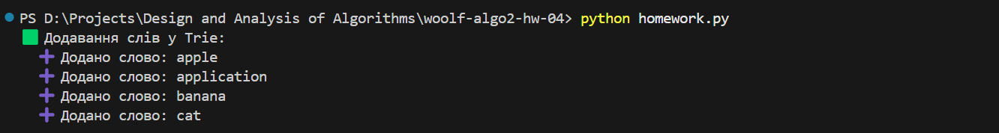
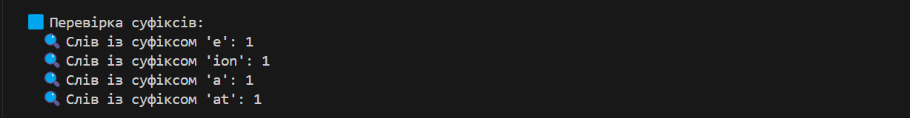
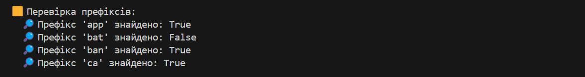
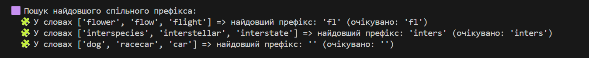
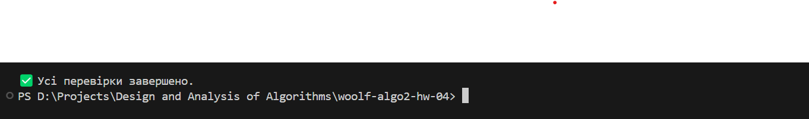

# woolf-algo2-hw-04

# Домашнє завдання: Префіксні дерева

Цей репозиторій містить реалізацію домашнього завдання до теми **"Префіксні дерева"** з курсу GoIT Neoversity.

---

## Структура проєкту goit-algo2-hw-04
```
goit-algo2-hw-04/
│
├── homework.py             # основний файл з усіма класами та тестами
├── README.md               # пояснення реалізації та інструкції
└── __init__.py             # порожній файл для сумісності як Python-пакет
```

---

## Завдання 1 — Розширення функціоналу Trie

### Реалізовано:
- `count_words_with_suffix(pattern: str) -> int`: підраховує кількість слів, що закінчуються на заданий суфікс.
- `has_prefix(prefix: str) -> bool`: перевіряє наявність хоча б одного слова з вказаним префіксом.

### Клас:
- `Homework`, що наслідує базовий `Trie`.

### Обробка помилок:
- Обидва методи валідують тип вхідного параметра.

### Демонстрація (скріншоти):

- Додавання слів у дерево:  
  

- Пошук за суфіксами:  
  

- Перевірка префіксів:  
  

---

## Завдання 2 — Найдовший спільний префікс

### Реалізовано:
- `find_longest_common_word(strings: list[str]) -> str`: знаходить найдовший спільний префікс усіх слів у масиві.

### Клас:
- `LongestCommonWord`, що також наслідує `Trie`.

### Демонстрація (скріншоти):

- Знаходження найдовшого спільного префікса:  
  

---

## Як запустити

`python homework.py`

- Фінальна перевірка:  
  